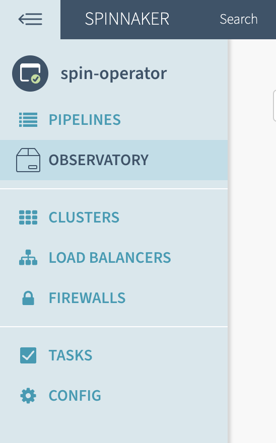
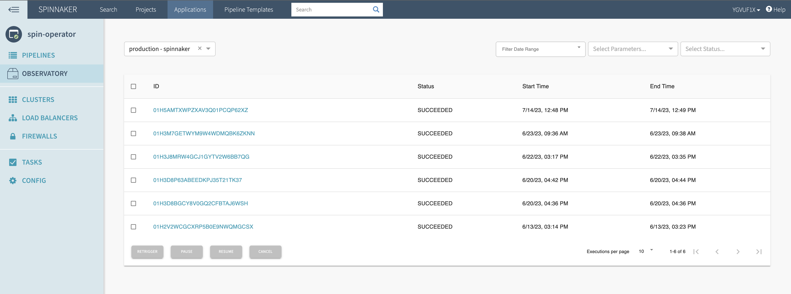
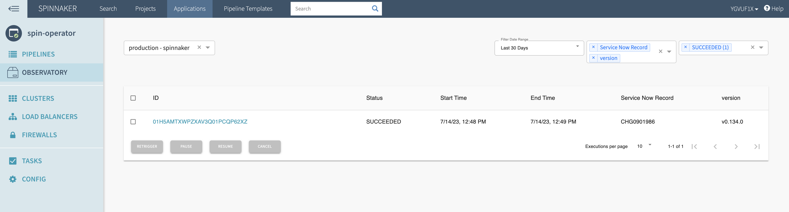
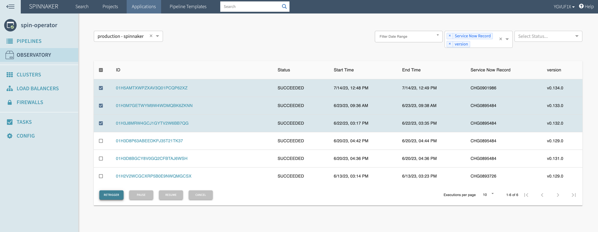

# spin-observatory-plugin
This plugin handles the "Observatory" tab when viewing
application in Spinnaker.

### Development
The easiest way to test your changes
is to create a pre-release of the plugin and update
the version of the plugin.
1. Create a tag 
```shell
git tag v0.1.0+2
git push --tags
```

2. Once you've pushed up the tags, keep an eye on the [release workflow](https://github.com/homedepot/spin-observatory-plugin/actions/workflows/release.yml).
3. Once it completes you can head over to the [gate-profile](https://github.com/one-thd/spin-operator-np-te-cd-tools/blob/main/deploy/spinnaker/np-te-cd-tools/base/profiles-gate.yml#L13) in [spin-operator-np-te-cd-tools](https://github.com/one-thd/spin-operator-np-te-cd-tool)
and update the plugin version to your latest release. Commit your change to get a new version of spin-operator
4. Run the [dev spinnaker pipeline](https://spinnaker.homedepot.com/#/applications/spin-operator/executions?pipeline=dev%20-%20spinnaker) with your operator version

### Usage 
The plugin will be available in the left-hand application menu



Once a pipeline is selected, the full view will be rendered showing executions and additional controls



The default view shows execution IDs, status, start time, and end time but additional fields can be displayed by selecting from the parameters dropdown. it's also possible to filter by both a date range and execution status to drill down and view only the desired executions.



**Pipeline Actions**

This plugin allows you to select any number of the displayed executions and perform batch actions on the selections. It's possible to pause or cancel running executions, resume paused executions, or rerun completed executions.

